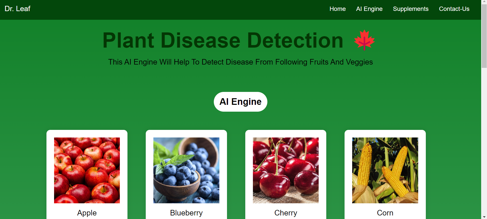
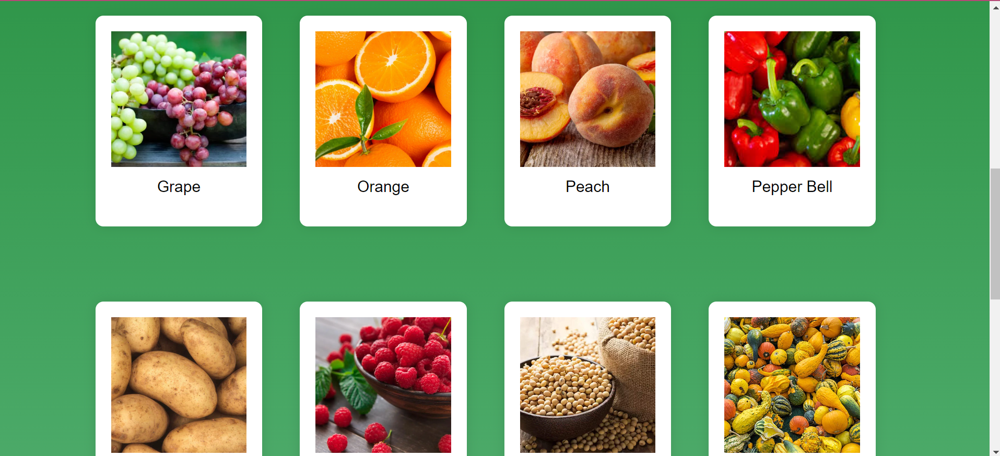
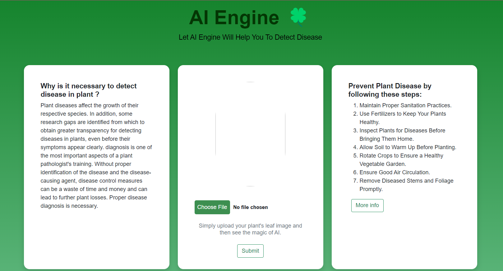
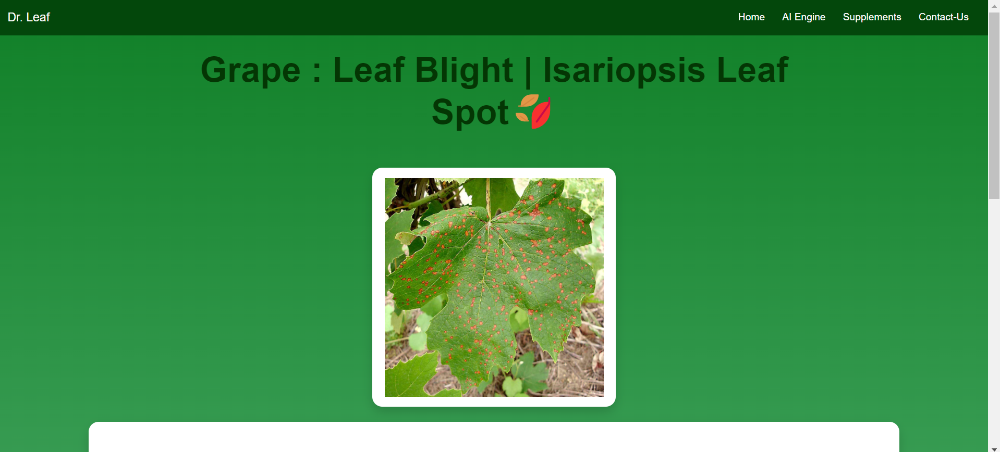
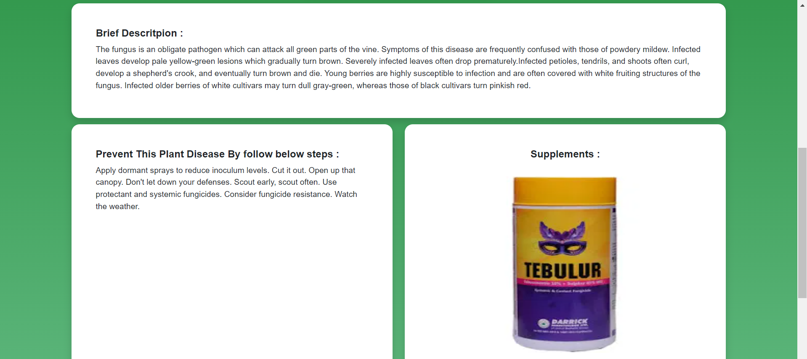
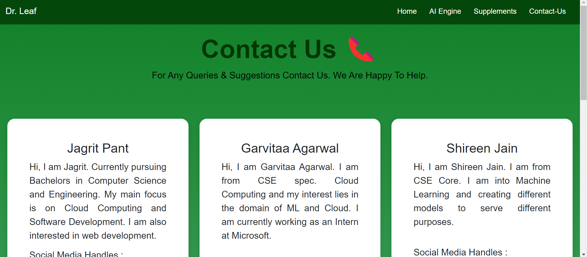

# Plant-Disease-Detection
Introducing Dr. Leaf, a plant disease detection model seamlessly integrated into a sophisticated web application. This solution offers farmers and gardeners a proactive approach to crop protection. Dr. Leaf enables early disease identification, coupled with intelligent prevention strategies tailored to specific threats. The user-friendly web application ensures accessibility for both agricultural professionals and enthusiasts, featuring an intuitive interface designed for efficient plant health management. Dr. Leaf is a dynamic system committed to continuous learning and adaptation through regular updates based on field testing, user feedback, and emerging threats.

## Deployed App
<a href="https://plant-disease-detection-ai.herokuapp.com/" target = "_blank">Plant-Disease-Detection</a> 

## Snippet of App :
#### Main page
  
  
#### AI Engine 
  
#### Results Page 
  
  
#### Supplements/Fertilizer  Store
  
#### Contact Us 
   
   